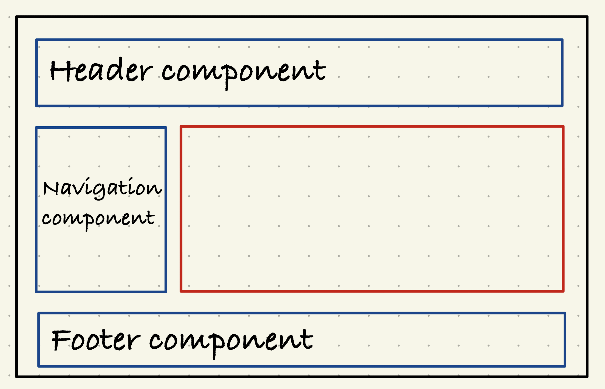

# Notes App

### .gitignore
- [Node.gitignore](https://github.com/iksergey/gitignore/blob/main/Node.gitignore)
- [VisualStudio.gitignore](https://github.com/iksergey/gitignore/blob/main/VisualStudio.gitignore)

### React – фреймворк для создании одностраничных приложений.
- [React JS](https://www.reactjs.org)

1. Основан на компонентах
2. Декларативное представление
3. Компонентная логика (написана на JS)
4. Поддерживает адаптивный дизайн и современные библиотеки

```
                        ┌────────────┐
JavaScript  ╴ ╴ ╴ ╴ ╴ ╴ │ Components │ ┄┄┄┄┄┄┄┄┄┄┄┄┄┄┄┄┄┄┄┄┄┄┄┄ Render HTML
   file                 └─┬──┬────┬──┘                               ╵
                          │  │    └────────────┐                     ╵
                          │  └────────────┐    │                     ╵
                        ┌─┴────────────┐  │  ┌─┴────────────┐      State (life cycle)
                        │    Child     │  │  │    Child     │
                        │ components 1 │ ... │ components N │
                        └──────────────┘     └──────────────┘
```
Ключевые слова

- Компонент (Components) – ключевое понятие в приложении React. 
  - Отображает представление пользовательского интерфейса
  - JavaScript-файл, содержащий логику приложения и/или обработку событий для представления

- Свойства (props) - объект, по средствам которого данные из родительского компонента передаются в дочерний компонент

- Состояние (State) – хранит информацию о компоненте. Когда состояние изменится, компонент выполнит повторный рендеринг.

- [Hooks](https://react.dev/reference/react) – механизм, позволяющий использовать локальное состояние и другие функции React без написания нового класса

- Модуль (Module) – несколько связанных компонентов, которые создают определенное представление.

React App


## Создание пустого приложения
- `npx create-react-app client-app`
- `cd client-app`
- `npm start`

## Красота
-[Bootstrap](https://getbootstrap.com)

- `npm install uuid` [url](https://www.npmjs.com/package/uuid)


- `dotnet new sln -n NotesApp`
- `dotnet new webapi -n Api`
- `dotnet new classlib -n Persistence`
- `dotnet new classlib -n Domain`
- `dotnet sln add Api/Api.csproj`
- `dotnet sln add Persistence/Persistence.csproj`
- `dotnet sln add Domain/Domain.csproj`
- `cd Api && dotnet add reference ../Persistence/Persistence.csproj`
- `cd ../Persistence && dotnet add reference ../Domain/Domain.csproj`
- `cd .. && dotnet restore`